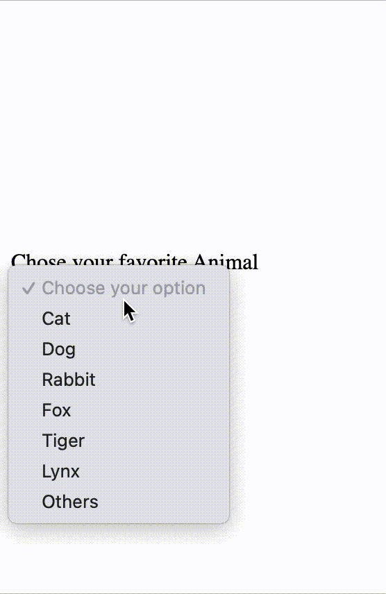

# Entrance exam for mentor

- Đối với câu hỏi lý thuyết, bạn viết ra một file .txt.
- Thời gian làm bài 2h30’
- Liên hệ TE đểấy link nộp bài nhé
- Tạo 1 folder họ và tên, nộp toàn bộ source code và những file liên quan. 

## HTML/CSS/JS

### Kiến thức về HTML
1. viết code html để liên kết file js & css từ page.html & index.html cấu trúc thư mục sau.
Cây thư mục của các file hiện tại   
```txt
project
├── assets
│   ├── css
│   │   ├── index.css
│   │   └── page.css
│   ├── js
│   │   ├── index.js
│   │   └── page.js
│   └── page.html
└── html
    └── index.html
```
---


2. Hãy nêu sự khác biệt giữa `<textarea>` & `<input>` elements


---

3. Làm một combobox như hình




---

### Kiến thức về CSS 

1. Liệt kê 5 CSS pseudo class/element

---

2. Hãy nêu sự khác nhau của hệ màu RGBA so với RGB

---

3. Sử dụng thuộc tính CSS phù hợp khiến một hình ảnh (vuông) trở thành hình tròn.

```html
<div class="rounded">
</div>
```

```css
div{
    width: 500px;
    height: 500px;
    background-color:yellow;
}
```

---


4. Chỉ sử dụng CSS, hãy di chuyển vị trí các ô trở nên sang như hình mẫu với cấu trúc HTML/CSS cho sẵn


```html
<div class="container border">
    <div class="rectangle red"></div>
    <div class="square green"></div>
    <div class="square green"></div>
    <div class="square yellow"></div>
    <div class="square yellow"></div>
    <div class="rectangle blue"></div>
</div>
```

```css
.red{
    background-color: red;
}
.yellow{
    background-color: yellow;
}
.green{
    background-color: green;
}
.blue{
    background-color: blue;
}
.container {
    position: relative;
    left: 0;
    top: 0;
    width: 600px;
    height: 600px;
}
.square{
    width: 200px;
    height: 200px;
}
.rectangle{
    width: 300px;
    height: 100px;
}
```

---

### Kiến thức về Javascript

1. Có bao nhiêu cách viết vòng lặp for? Nêu cấu trúc phù hợp với các loại vòng lặp?

---

2. Kết quả của đoạn code là gì? Giải thích
```js
function f (){
        let b = 9
        return ++b < 10 ? b : 'Yah'
    }
    let a = f()
    console.log(a)
```
                       
---

3. Đề xuất giải pháp thay thế cấu trúc if else sau đây để khiến code trở nên gọn gàng (Lưu ý chỉ cần nêu cách ngắn gọn, không cần code lại).
Chữ La Mã hàng đơn vị. Sửa đổi hàm `roman_unit`

```js
function roman_unit(decimal_number) {
        let decimal = parseInt(decimal_number)
        let roman_number = ""
        if (decimal_number == 1) {
            roman_number = "I"

        } else if (decimal_number == 2) {
            roman_number = "II"

        } else if (decimal_number == 3) {
            roman_number = "III"

        } else if (decimal_number == 4) {
            roman_number = "IV"

        } else if (decimal_number == 5) {
            roman_number = "V"

        } else if (decimal_number == 6) {
            roman_number = "VI"

        } else if (decimal_number == 7) {
            roman_number = "VII"

        } else if (decimal_number == 8) {
            roman_number = "VIII"

        } else if (decimal_number == 9) {
            roman_number = "IX"

        } else if (decimal_number == 10) {
            roman_number = "X"

        } else {
            roman_number = "?"
        }
        return roman_number
    }
    let result = roman_unit(9)
```

---


4. Viết một regular expression có thể match được email. Ví dụ 

```txt
Letters to the Editor (Your complete mailing address is required):
letters@thehindu.co.in
Readers' Editor:
readerseditor@thehindu.co.in
Advertisements Queries (Print):
inetads@thehindu.co.in
Advertisements Queries (Online):
digital@thehindu.co.in
Advertisements Queries (International):
international@thehindu.co.in
Subscription Queries:
subs@thehindu.co.in
Comments on the website:
web.thehindu@thehindu.co.in
```
```txt
digital@thehindu.co.in;
inetads@thehindu.co.in;
international@thehindu.co.in;
letters@thehindu.co.in;
readerseditor@thehindu.co.in;
subs@thehindu.co.in;
web.thehindu@thehindu.co.in;
```
            
---


5. Hãy cho biết kết quả đoạn code sau và giải thích.
```js
function resolveAfter2Seconds() {
  console.log("starting slow promise")
  return new Promise(resolve => {
    setTimeout(function() {
      resolve("slow")
      console.log("slow promise is done")
    }, 2000)
  })
}

function resolveAfter1Second() {
  console.log("starting fast promise")
  return new Promise(resolve => {
    setTimeout(function() {
      resolve("fast")
      console.log("fast promise is done")
    }, 1000)
  })
}

async function sequentialStart() {
  console.log('==SEQUENTIAL START==')
  const slow = await resolveAfter2Seconds()
  console.log(slow) 
  const fast = await resolveAfter1Second()
  console.log(fast) 
}

async function concurrentStart() {
  console.log('==CONCURRENT START with await==');
  const slow = resolveAfter2Seconds() 
  const fast = resolveAfter1Second() 
  console.log(await slow) 
  console.log(await fast) 
}

function concurrentPromise() {
  console.log('==CONCURRENT START with Promise.all==')
  return Promise.all([resolveAfter2Seconds(), resolveAfter1Second()]).then((messages) => {
    console.log(messages[0]) 
    console.log(messages[1])
}

async function parallel() {
  console.log('==PARALLEL with await Promise.all==')
  await Promise.all([
      (async()=>console.log(await resolveAfter2Seconds()))(),
      (async()=>console.log(await resolveAfter1Second()))()
  ])
}

sequentialStart()
setTimeout(concurrentStart, 4000)
setTimeout(concurrentPromise, 7000)
setTimeout(parallel, 10000) 
```

---


6. Giải thích phương thức `element.insertAdjacentHTML()`. Viết một hàm 10 nút tương ứng, đi kèm với eventListener là in ra màn hình giá trị của nút đó (được cung cấp trong mảng) và chèn vào trong element có id là `container`.
```js
let animals = ['cat','rabbit','dog','fox','fish','racoon','tiger','bear','parrot','snake']
```

---

7. Từ câu tiếp theo trở đi sẽ sử dụng chung source code như sau. Đoạn code trên có thể chọn ngẫu nhiên 10 pokemon.
Bạn hãy chọn 1 trong 3 câu nhỏ dưới để làm. Làm được cả 3 câu sẽ có quà riêng.
```js
const domain = 'https://pokeapi.co/api/v2'
const endpoint = 'pokemon'

async function getPokemonNames(pokemonID) {
    const start_time = new Date().valueOf()
    const pokemonName = [];
    for (let i = 0; i < pokemonID.length; i++) {
        pokemonName.push(await getPokemon( `${domain}/${endpoint}/${pokemonID[i]}`))
    }
    return pokemonName
}

function main(){
    const pokemonId = []
    for (let i = 0; i < 10; i++) {
        pokemonId.push(Math.floor(Math.random() * 600))
    }
    console.time('Operation')
    getPokemonNames(pokemonId)
    .then(pokemons => {
        console.log(pokemons)
        console.timeLog("Operation")
    })
}
async function getPokemon(url) {
    // 
}
main()
```

a. Viết hàm `getPokemon` để chương trình chạy đúng, lấy dữ liệu thông endoints bằng `fetch()`, sau đó trả về mảng gồm tên của từng 
Pokemon. Viết bằng 2 cách (async - await & promise).

---

b. Đoạn code ở trên có thời gian thực thi ước tính trên trình duyệt Brave (nhân Chrome) là khoảng 3500ms (Có thể sai số bởi vì tốc độ mạng, server,...). Có cách nào giảm thời gian thực thi xuống không? Nếu có thì hãy trình bày giải pháp và giải thích.

---

c. Cập nhật hàm ở` main` để có thể kết thúc hàm công việc đang chạy (lấy dữ liệu) nếu thời gian chạy quá chậm  (> 2000ms)
Hàm main có thể dùng được viết lại như sau.


